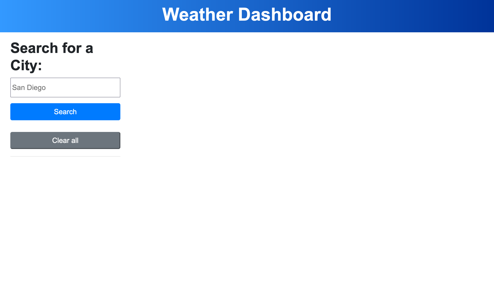

# Weather forecast

## Description

This is a weather application that displays weather data for the current day and the next upcoming five days. The current weather information contains data about the temperature, humidity, wind speed, and UV Index. The purpose of this project was to learn how to implement server-side APIs into my web applications. See [Usage](#usage) section for instructions on how to use this application. Currently, this application does not have an option to indicate which state or country the city is located in. 

In the future, I would like to add more informative alerts to my webpage, more descriptions to describe the weather, a dropdown for country and state, a button to delete only one item, an event listener if users press the enter key when searching for a city, add code to replace a city if it was already in the search history, and code to show the most updated weather conditions when a user clicks on a city button instead of showing past weather history.

## Installation
1. Use the `cd` command on your terminal to move to your desired installation directory.
2. Copy and paste the following code into your terminal:
```
git clone git@github.com:tyang896/weather-forecast.git
```
3. Press `Enter` or `Return` to execute the code
4. The repository should now be in your installation folder.

## Usage

You can view a live demonstration of the web application here: https://tyang896.github.io/weather-forecast/

1. To use this application, open the `index.html` page using a web browser. The web application should look like the following: 
   


2. Search for a city in the search bar and click on the `Search` button to see the weather results.


3. The weather results should look like the following:


The `UV Index` will have color codes to indicate whether conditions are safe or dangerous. 

UV radiation Scale:
- Green = Low 
- Yellow = Moderate
- Orange = High
- Red = Very High

4. To view previous searches, click on a button with the city name.


5. To clear all searches, click on the `Clear all` button.

